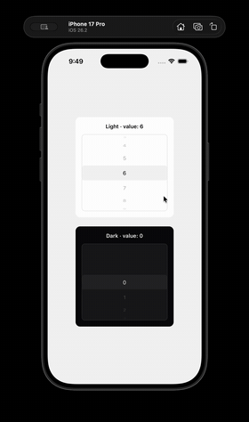
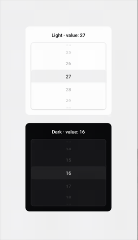
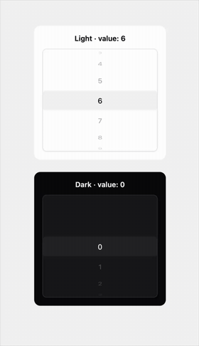

> **Status: Proof of Concept** - built as a standalone experiment to validate the approach before moving it into our app.

A smooth, cross-platform wheel picker for React Native, powered by [Reanimated](https://docs.swmansion.com/react-native-reanimated/).

- iOS-style 3D wheel, animated on the UI thread by Reanimated
- Works on iOS, Android, and Web (mouse drag + momentum included)
- Controlled & uncontrolled, with `onChanging` ticks for haptics or sound
- Unstyled by default — every visual layer is a style slot

## Demo

|                           iOS                           |                             Android                             |                           Web                           |
| :-----------------------------------------------------: | :-------------------------------------------------------------: | :-----------------------------------------------------: |
|  |  |  |

## Usage

```tsx
const options = Array.from({ length: 10 }, (_, i) => ({
  value: i,
  label: i.toString(),
}));

export const Example = () => {
  const [value, setValue] = useState(5);

  return (
    <WheelPicker
      options={options}
      value={value}
      onChange={setValue}
      onChanging={() => Haptics.selectionAsync()}
      optionItemHeight={40}
      visibleCount={5}
    />
  );
};
```

## Props

| Prop                 | Type                        | Default | Description                                             |
| -------------------- | --------------------------- | ------- | ------------------------------------------------------- |
| `options`            | `WheelPickerOption<T>[]`    | —       | Options to display: `{ value, label }`.                 |
| `value`              | `T`                         | —       | Selected value (controlled).                            |
| `defaultValue`       | `T`                         | —       | Initial value (uncontrolled).                           |
| `onChange`           | `(value: T) => void`        | —       | Called when the wheel settles on an option.             |
| `onChanging`         | `(value: T) => void`        | —       | Called for each row passing the center while scrolling. |
| `optionItemHeight`   | `number`                    | `40`    | Height of each option row.                              |
| `visibleCount`       | `number`                    | `5`     | Number of visible rows. Must be odd.                    |
| `enableItemPress`    | `boolean`                   | `true`  | Tap an option to select it.                             |
| `optionKeyExtractor` | `(option, index) => string` | index   | Unique key for each option.                             |
| `styles`             | `WheelPickerStyles`         | —       | Style slots, see below.                                 |

## Styling

The picker is unstyled by default — every visual layer is exposed as a slot via the `styles` prop:

```tsx
<WheelPicker
  // ...
  styles={{
    root: { backgroundColor: "white" },
    highlightedArea: { backgroundColor: "#f2f2f2", borderRadius: 8 },
    itemText: { fontSize: 18, color: "#111" },
  }}
/>
```

| Slot               | Applies to                                                  |
| ------------------ | ----------------------------------------------------------- |
| `root`             | Outer wrapper hosting the wheel, highlight, and masks.      |
| `contentContainer` | The ScrollView's content container.                         |
| `highlightedArea`  | The bar marking the selected row (renders under the label). |
| `itemContainer`    | Each row's container, before the drum transform.            |
| `itemText`         | Typography of every option label.                           |
| `scrim`            | Top/bottom gradient masks fading out unselected rows.       |
